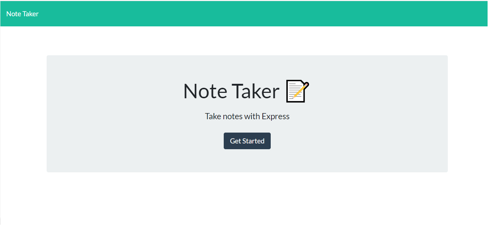
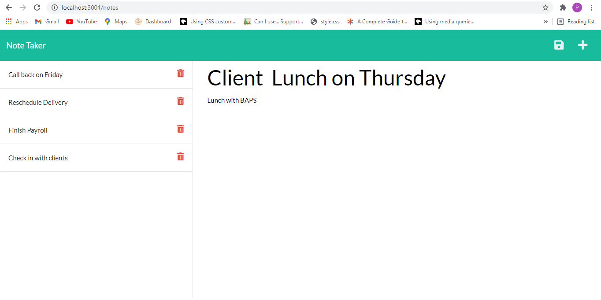
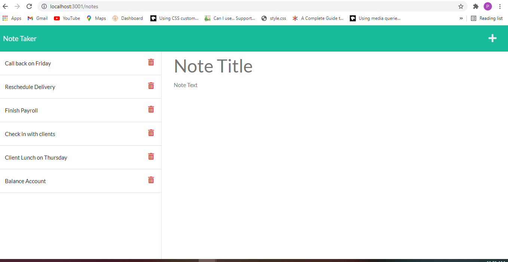

# Note-Taker

## Table of Contents
* [Description](#description)
* [Technologies](#technologies)
* [Preview](#preview)
* [Deployed](#deployed)
* [Questions](#questions)
* [Credits](#Credits)

##  Description
For users that need to keep track of a lot of information, it's easy to forget and that is something very important. Note-taking is application for users that need to keep track of a lot of information. The application allows the user to take notes and have written information available when needed.

## Technologies
* JavaScript
* HTML
* CSS
* Node.js
* Express.js
* UUID

## Preview

## Deployed

## Questions
Have questions about this project?  
GitHub: https://github.com/patelpr03  
Email:  patelpr_03@yahoo.com

## Credits

http://localhost:3001/note